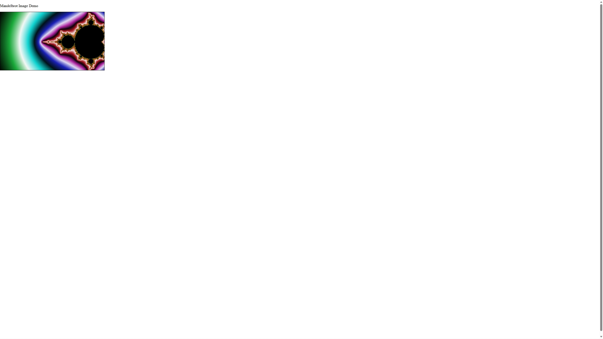

# Introduction 

This project creates a simple interface for generating images of the Mandelbrot fractal.
The purpose of the project is to be used as a mathematical teaching aid.
Additionally it is meant to demonstrate the coding ability of its author: Danielle Minnaar.

# Getting Started

1.  Prerequisites:
    The backend server of this project is run on ASP.NET Core 9.0.
    Ensure you have installed version 9.0.10+ of the SDK from: https://dotnet.microsoft.com/en-us/download/dotnet/9.0.

    The frontend needs npm 10.9+.
    Ensure you have installed the correct version from: https://www.npmjs.com/package/npm.

2.  Installation:
    The backend server can be found at: https://github.com/danielle-minnaar/mandelbrot-backend.
    To install on commandline:
    `git clone https://github.com/danielle-minnaar/mandelbrot-backend.git`
    `cd mandelbrot-backend`
    `dotnet restore`
    `cd ..`
    
    The frontend application can be found at: https://github.com/danielle-minnaar/mandelbrot-frontend
    To install on commandline:
    `git clone https://github.com/danielle-minnaar/mandelbrot-frontend`
    `cd mandelbrot-frontend`
    `npm install --force`
    `cd ..`

# Build and Run

Activate the backend server on commandline:
    Check that you are in the correct directory:
    `pwd`
    Should return something like:
    `C:/Users/CurrentUser/YourDirectory/mandelbrot-backend`
    Once you are in the correct directory:
    `dotnet run`

Activate the frontend application on commandline:
    Check that you are in the correct directory:
    `pwd`
    Should return something like:
    `C:/Users/CurrentUser/YourDirectory/mandelbrot-frontend`
    Once you are in the correct directory:
    `npm start`
    `o`

This should open the browser on the correct page:
    

# Contribute

If you are a capgemini employee and I have asked you to look at my code, first of all thank you for taking the time to help me. If you spot any bugs or have any comments to improve the code, please send me a message on teams or create a comment here: https://dev.azure.com/nl-csd-microsoft/Full%20Stack%20Stream/_git/minnaar-feedback?path=%2F&version=GBdev&_a=contents.

If you would like to modify the code in any way I recommend that you create your own branch.

# License

Copyright (c) Danielle Minnaar. All rights reserved.

Licensed under the [MIT](LICENSE) license.